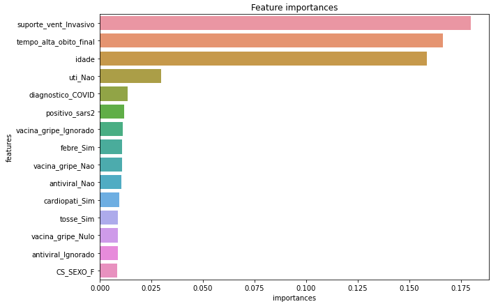

# Trabalho de Conclusão de Curso -- MBA Analytics Data Science FIA

## Modelagem e tratamento das variáveis

### Modelagens Iniciais

Comecei fazendo a modelagem pela modelagem estatística. Inicialmente fiz a modelagem utilizando as variáveis "Idade" e "Tempo de alta ou óbito" como numéricas e todas as outras variáveis como categóricas ou dummies. Além disso, nesta etapa, ainda não havia removido os ignorados e nulos da base. Notebook em questão: [Modelagem_2020_2021-arvore.ipynb](https://github.com/guilhermehge/Analises-e-modelagens-Data-Science/blob/main/Classifica%C3%A7%C3%A3o/Trabalho%20de%20conclus%C3%A3o%20de%20curso%20--%20MBA/Modelagem%20e%20Tratamento/Modelagens%20iniciais/Modelagem_2020_2021-arvore.ipynb)

A base utilizada neste notebook está no [link](https://drive.google.com/file/d/1Zz1AvOq5OvluWcqoCJyTUPyxfyYhjrOK/view?usp=sharing).

Escolhi o modelo de árvore para modelar e, como resultado, segue o "feature importance" do modelo base:

É possível observar que "Idade" e "Tempo de alta ou óbito" possuem uma forte importância no modelo, porém, como são variáveis numéricas e possuem alta cardinalidade, ou seja, possibilitam infinitas quebras, naturalmente seriam já classificadas como variáveis de alta importância, conforme indica a [documentação da árvore de decisão do sklearn](https://scikit-learn.org/stable/modules/generated/sklearn.tree.DecisionTreeClassifier.html#:~:text=Warning%3A%20impurity%2Dbased%20feature%20importances%20can%20be%20misleading%20for%20high%20cardinality%20features). Além disso, é possível observar que aparecem classes "Ignorado" e "Nulo" no gráfico de feature importance, o que dificulta a interpretabilidade dos resultados. O restante do notebook é uma tentativa de otimizar alguns hiperparâmetros do modelo sem utilizar técnicas avançadas, uma vez que era a proposta da entrega, porém os problemas acima dificultavam continuar utilizando o banco de dados da forma que estava.

Desse modo, decidi, inicialmente, por transformar as variáveis "Idade" e "Tempo de alta ou óbito" em categóricas e modelar a partir disso. Notebook em questão: [Modelagem_idade_tempo_alta_cat_2020_2021.ipynb](https://github.com/guilhermehge/Analises-e-modelagens-Data-Science/blob/main/Classifica%C3%A7%C3%A3o/Trabalho%20de%20conclus%C3%A3o%20de%20curso%20--%20MBA/Modelagem%20e%20Tratamento/Modelagens%20iniciais/Modelagem_idade_tempo_alta_cat_2020_2021.ipynb).

O feature importance do modelo base então foi:

Observa-se que agora temos idosos com alta importância e o tempo de alta ou óbito diminuiu sua importância, o que confirma o viés da alta cardinalidade das variáveis. Apesar de ser uma evolução, ainda conseguimos ver categorias de "Ignorado" no gráfico, o que dificulta a interpretabilidade do modelo. O restante do notebook segue na mesma linha do anterior.

### Modelagens Finais

